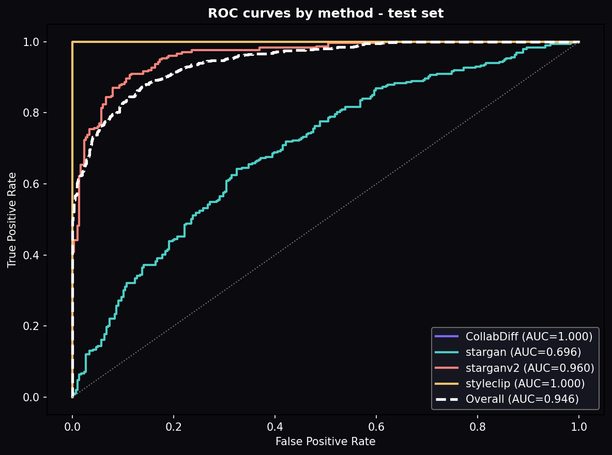
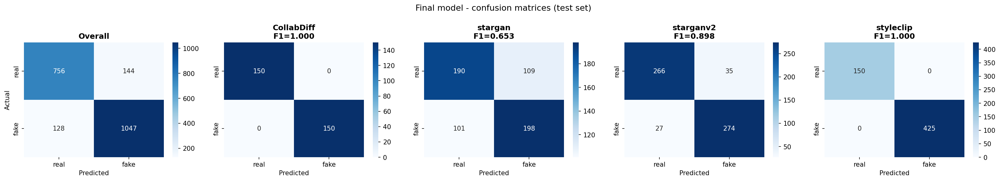
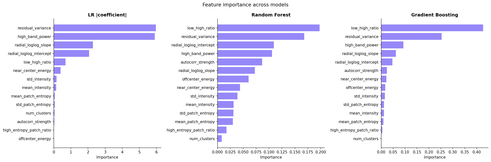
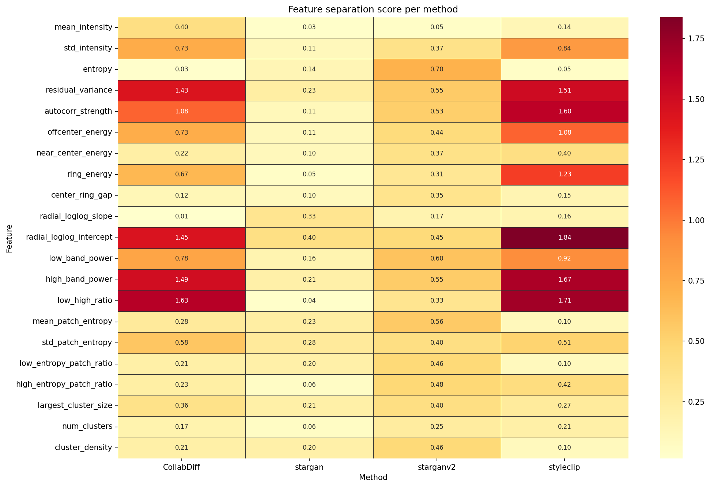
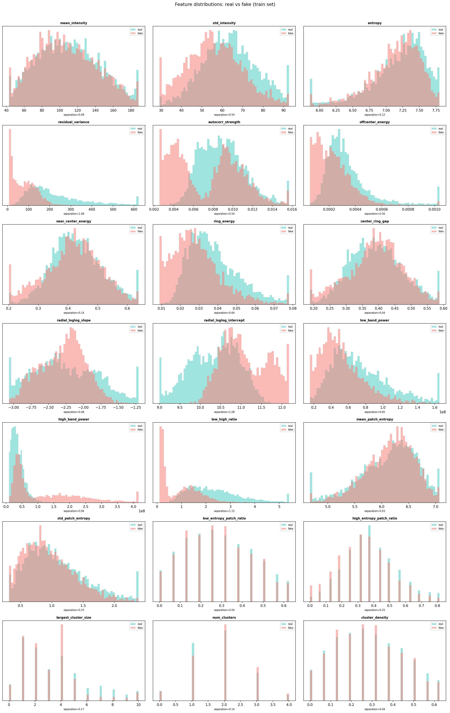
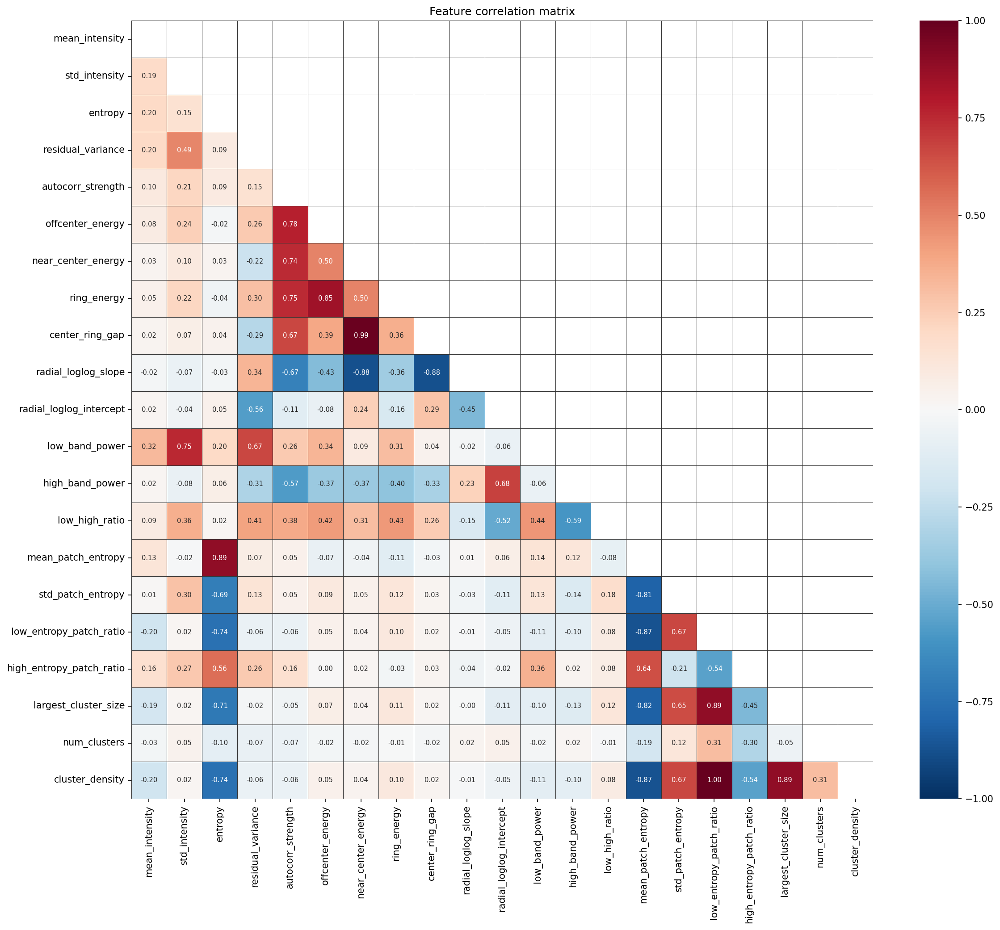

# deepfake-real-vs-fake-feature-classifier

This repository contains a full, reproducible pipeline for classifying `real` vs `fake` face images using handcrafted signal-processing features and classical ML models.

## What This Repo Contains

- Manifest builder with per-method stratified split:
  - `build_manifest.py`
- Feature extraction (intensity, residual, frequency, patch):
  - `extract_features.py`
- Model training and validation comparison:
  - `train_models.py`
- Final locked test evaluation:
  - `final_test_eval.py`

## What Is Not Included

Large local assets are intentionally excluded from Git:

- Raw datasets (`extracted/`)
- Augmented images (`styleclip_train_real_aug/`)
- Generated manifests and large intermediate outputs (`train.csv`, `features/`)
- Local virtual environment (`.venv/`)

Selected `analysis/` and `results/` artifacts are committed so the GitHub page shows the final outputs directly.

See `.gitignore` for full rules.

## Environment Setup

```bash
python3 -m venv .venv
source .venv/bin/activate
pip install -r requirements.txt
```

## Expected Data Layout

Place datasets under `extracted/` in this form:

```text
extracted/
  CollabDiff/CollabDiff/{real,fake}/...
  stargan/stargan/{real,fake}/...
  starganv2/starganv2/{real,fake}/...
  styleclip/styleclip/{real,fake}/...
```

## Run Order

```bash
# 1) Build train/val/test manifests (+ styleclip train-real augmentation)
python build_manifest.py

# 2) Extract features
python extract_features.py

# 3) Analyze features
# (analysis script used in session; optional)

# 4) Train/compare models on val
python train_models.py

# 5) Final locked test evaluation (single run)
python final_test_eval.py
```

## Final Model (Session Result)

- Model: `GradientBoostingClassifier`
- Feature set: 10 non-patch features (frequency + residual + basic intensity)
- Test metrics:
  - F1 (fake): `0.8850`
  - ROC-AUC: `0.9458`
- Precision: `0.8791`
- Recall: `0.8911`

Per-method performance details are written to `results/final_results.json` when the pipeline is run locally.

## Results

### Per-method performance (test set)

| Method | F1 | AUC |
|---|---:|---:|
| CollabDiff | 1.000 | 1.000 |
| StyleCLIP | 1.000 | 1.000 |
| StarGAN v2 | 0.898 | 0.960 |
| StarGAN | 0.653 | 0.696 |
| **Overall** | **0.885** | **0.946** |





### Feature importance

All three models agree on the same core features: `low_high_ratio`, `residual_variance`, and `high_band_power`. Patch entropy features contributed very little and were dropped after ablation, which is why the final model uses a compact 10-feature set.



### Per-method signal separation

The per-method heatmap shows why `stargan` is the hardest subset: most features separate weakly there, while `CollabDiff` and `StyleCLIP` separate strongly on frequency and residual cues.



### Exploratory analysis

Global feature distributions and correlation structure are also included for inspection.




